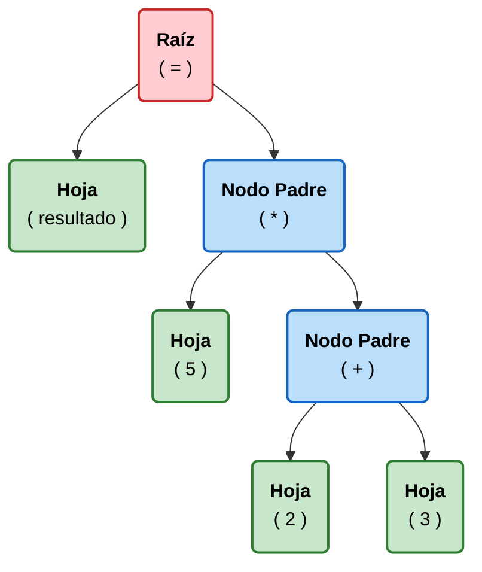

# Glosario

## 1. Arboles
Un árbol es una estructura de datos jerárquica y no lineal compuesta por nodos conectados entre sí. 

### Conceptos fundamentales de la estructura:

* Nodo: Cada elemento del árbol que contiene información (como una variable, un número o un operador).
* Raíz (Root): El nodo superior del que parten todos los demás. En Python, la raíz representa el programa completo o un módulo.
* Padres e Hijos: Un nodo "padre" tiene conexiones hacia nodos inferiores llamados "hijos". Por ejemplo, en una operación `x = 5 + 3`, el nodo del operador `+` es padre de los nodos **5** y **3**.
* Hojas (Leaves): Los nodos finales que no tienen hijos; suelen ser los valores literales o nombres de variables.

