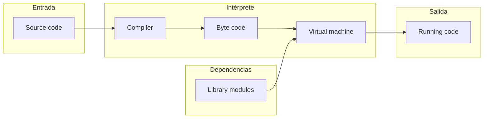

# Características Fundamentales de Python

Antes de adentrarse en la sintaxis y las estructuras de datos, es imperativo comprender la arquitectura subyacente y las decisiones de diseño que definen a Python. 
Estos conceptos son la base para entender cómo el lenguaje procesa las instrucciones, gestiona la memoria y maneja los datos.
---
## 1. Naturaleza del Lenguaje: Interpretado y Compilado a Bytecode

Típicamente, se clasifica a Python como un lenguaje interpretado, pero esta definición es incompleta. 
El proceso de ejecución en la implementación estándar de Python (CPython) no procesa el código fuente (archivos `.py`) directamente sobre el hardware ni lo traduce a código máquina nativo. 
En su lugar, consta de dos fases principales e interdependientes: una compilación a un formato intermedio y una posterior interpretación.

**Fase 1: El Compilador Interno**
Cuando se ejecuta un script, el código fuente pasa primero por el compilador interno de Python, el cual realiza la traducción a un formato intermedio de bajo nivel llamado **bytecode**. Este proceso se divide en las siguientes etapas:

* **Analizador Léxico (Lexer):** Rompe el código fuente en unidades lógicas y básicas llamadas *tokens* (como palabras clave, operadores, identificadores y números).
* **Analizador Sintáctico (Parser):** Organiza los tokens generados en una estructura jerárquica llamada Árbol de Sintaxis Concreta (CST) y luego los simplifica en un Árbol de Sintaxis Abstracta (AST). 
En esta etapa se verifica estrictamente que todas las reglas gramaticales e identaciones del lenguaje se cumplan.
* **Generador de Bytecode:** Recorre el AST y lo traduce en un conjunto de instrucciones de bajo nivel (bytecode) que la máquina virtual de Python es capaz de procesar. 
Este resultado suele almacenarse en caché (archivos `.pyc` dentro del directorio `__pycache__`) para acelerar futuras ejecuciones.

**Fase 2: La Máquina Virtual de Python (PVM)**
Una vez generado el bytecode, este es transferido a la **Python Virtual Machine (PVM)**, que actúa como el motor de ejecución en tiempo real. La PVM es un intérprete basado en pilas (stack-based) compuesto por los siguientes subsistemas:

* **Bucle de evaluación (Evaluation Loop):** Es el corazón de la PVM; un ciclo continuo que lee y procesa secuencialmente cada instrucción del bytecode, ejecutando las rutinas correspondientes.
* **Pila de valores (Value Stack):** Es la estructura de datos principal y el espacio de memoria temporal donde la PVM apila y desapila los datos, referencias y operandos durante la ejecución matemática o lógica de las instrucciones.
* **Gestor de memoria y Recolector de basura:** El subsistema encargado de administrar dinámicamente la asignación de memoria para los nuevos objetos y la liberación automática de los recursos inalcanzables en el sistema, evitando fugas de memoria.


    
Al ejecutar por primera vez un archivo `.py`, Python debe realizar todo el proceso léxico y sintáctico para generar el bytecode. 
Sin embargo, en la siguiente ejecución, si el código fuente no ha sido modificado, Python detectará el archivo `.pyc` guardado, 
omitirá por completo el proceso del compilador interno y cargará el bytecode directamente en el Bucle de Evaluación de la PVM, optimizando drásticamente los tiempos de carga.

---

## 2. Gestión de Memoria y Recolector de Basura (Garbage Collector)

En lenguajes de bajo nivel como C, el programador debe asignar y liberar memoria manualmente (mediante `malloc` y `free`). Python abstrae esta complejidad mediante una gestión de memoria automática que recae principalmente en dos mecanismos: el **conteo de referencias** y el **recolector de basura generacional** (Generational Garbage Collector).

* **Conteo de Referencias (Reference Counting):** Todo objeto en Python contiene un campo interno que lleva la cuenta de cuántas referencias (variables o estructuras de datos) apuntan hacia él. Cuando una referencia se reasigna o sale de su ámbito de ejecución (scope), el contador disminuye. Si el contador llega a cero, el objeto es destruido inmediatamente y su memoria es devuelta al sistema.
* **Recolector de Basura Generacional:** El conteo de referencias tiene un defecto inherente: no puede resolver dependencias cíclicas (por ejemplo, el objeto A hace referencia al objeto B, y el objeto B hace referencia al objeto A).
Para solucionar esto, Python implementa un recolector de basura que escanea periódicamente la memoria en busca de grupos de objetos inalcanzables (todavía existen en la memoria, pero ya no pueden ser accedidos de ninguna forma.). 
Utiliza un enfoque "generacional", dividiendo los objetos en tres generaciones (0, 1 y 2) basándose en su tiempo de vida; los objetos nuevos se revisan con mayor frecuencia que los antiguos.
  * Generación 0: Aquí nacen todos los objetos nuevos. Es la que se escanea con más frecuencia porque es donde más objetos suelen quedar sin uso rápidamente.
  * Generación 1: Si un objeto sobrevive a un escaneo de la Gen 0, se "promociona" a la Gen 1. Se escanea con menos frecuencia.
  * Generación 2: Es el nivel más alto. Aquí residen los objetos de larga duración (como configuraciones globales o módulos cargados). Es la que menos se escanea para no desperdiciar recursos de CPU.

### ¿Por qué es importante esta distinción?
El conteo de referencias es muy eficiente, pero insuficiente, mientras que el recolector generacional es exhaustivo pero costoso en términos de procesamiento. Al combinarlos, Python logra un equilibrio entre velocidad y seguridad de memoria.

**Ejemplo:**

```python
import sys

# Se crea un objeto en memoria (una lista) y 'a' hace referencia a él.
a = [1, 2, 3] 

# sys.getrefcount(a) devolverá 2 (la referencia de 'a' y la del propio argumento de getrefcount)
print(sys.getrefcount(a))

b = a # Ahora 'b' apunta al mismo espacio de memoria. El contador sube a 3.

del a # Se elimina la referencia 'a'. El contador baja a 2.
del b # Se elimina la referencia 'b'. El contador llega a 0 (ignorando llamadas internas) y la memoria se libera automáticamente.

```
---

## 3. Sistema de Tipado: Dinámico y Fuerte

El tipado en programación es el conjunto de reglas que define cómo un lenguaje maneja los tipos de datos (números, texto, booleanos) y sus restricciones.

* **Tipado Dinámico:** La comprobación de tipos se realiza en tiempo de ejecución (runtime), no en tiempo de compilación. 
Las variables en Python no tienen un tipo de dato intrínseco declarado; son simplemente etiquetas (punteros) que referencian a objetos en la memoria.
El tipo de dato reside en el objeto mismo, no en la variable. Por lo tanto, una misma variable puede apuntar a un número entero en una línea y a una cadena de texto en la siguiente.

```python
# Tipado dinámico:
x = 10        # 'x' referencia a un objeto entero (int)
x = "Hola"    # Ahora 'x' referencia a un objeto de cadena (str). No hay error de compilación.
```
* **Duck Typing:**
La idoneidad de un objeto para una operación se evalúa por la presencia de ciertos métodos o atributos, más que por el tipo real del objeto
(*Si camina como un pato y grazna como un pato, entonces debe ser un pato*).

```python
class Duck:
    def speak(self):
        return "Quack!"

class Dog:
    def speak(self):
        return "Woof!"

class Cat:
    def speak(self):
        return "Meow!"

def animal_sound(animal):
    # Python doesn't care about the type, just the 'speak' method
    print(animal.speak())

animal_sound(Duck()) # Output: Quack!
animal_sound(Dog())  # Output: Woof!
animal_sound(Cat())  # Output: Meow!
```
* **Tipado Fuerte:** A pesar de ser dinámico, Python es "estricto" con las operaciones entre tipos distintos.
No hay conversiones implícitas, si intentas sumar un número y un texto (`5 + "10"`), Python lanzará un error (`TypeError`) en lugar de intentar adivinar el resultado (a diferencia de JavaScript, que devolvería "510").

```python
# Tipado fuerte:
a = 5
b = " manzanas"
# resultado = a + b  # Esto lanzará un TypeError. Python no convertirá el 5 a "5" de forma implícita.
resultado = str(a) + b # Se requiere conversión explícita (casting).

```

---

## 4. Indentación Estricta (Estructura de Bloques)

A diferencia de la mayoría de lenguajes derivados de C (como C++, Java o JavaScript) que utilizan llaves `{}` para delimitar bloques lógicos de código y puntos y comas `;` para terminar sentencias, Python utiliza el espacio en blanco de forma semántica.

La **indentación estricta** obliga al programador a alinear visualmente las declaraciones que pertenecen a un mismo bloque lógico (como el cuerpo de un bucle `for`, una declaración `if` o la definición de una función). 
Internamente, el analizador léxico de Python genera tokens especiales (`INDENT` y `DEDENT`) basados en los cambios del nivel de sangría para construir el Árbol de Sintaxis Abstracta (AST).

**Ejemplo:**

```python
def evaluar_numero(num):
    # Inicio del bloque de la función (Nivel de indentación 1)
    if num > 0:
        # Inicio del bloque condicional (Nivel de indentación 2)
        print("Positivo")
        # Fin del bloque condicional
    else:
        # Inicio de otro bloque condicional (Nivel de indentación 2)
        print("Cero o Negativo")
# Fin del bloque de la función (Nivel de indentación 0)

```

---

## 5. Multiparadigma

Un paradigma de programación es un enfoque, estilo o metodología para estructurar y desarrollar software.
Dicta la forma en que los programadores conceptualizan y resuelven problemas, definiendo reglas, características y buenas prácticas para el diseño de lenguajes de programación. 

Python no fuerza al desarrollador a adoptar un único paradigma. Es un lenguaje **multiparadigma** que "soporta" nativamente la interacción de diferentes paradigmas:

* **Paradigma Estructurado:** Ejecución de sentencias de forma secuencial, alterando el estado del programa a través de variables y estructuras de control de flujo (bucles, condicionales).
* **Programación Orientada a Objetos (POO):** En Python, "todo es un objeto". Esto incluye funciones, clases base, tipos primitivos e incluso módulos. Soporta abstracción, herencia (incluyendo herencia múltiple), encapsulamiento y polimorfismo.
* **Programación Funcional:** Python soporta características fundamentales del paradigma funcional, tratando a las funciones como *ciudadanos de primera clase* (first-class citizens). Esto permite pasar funciones como argumentos, retornarlas como valores, y utilizar funciones de orden superior como `map()`, `filter()` y `reduce()`, además de contar con funciones anónimas (`lambda`).

**Ejemplo:**

```python
# Enfoque Estructurado
numeros = [1, 2, 3, 4, 5]
cuadrados_imp = []
for n in numeros:
    cuadrados_imp.append(n ** 2)

# Enfoque Funcional (usando map y funciones lambda)
cuadrados_func = list(map(lambda x: x ** 2, numeros))

# Enfoque Orientado a Objetos (definición de un comportamiento en una clase)
class Calculadora:
    def elevar_cuadrado(self, lista):
        return [x ** 2 for x in lista]

calc = Calculadora()
cuadrados_poo = calc.elevar_cuadrado(numeros)

```
